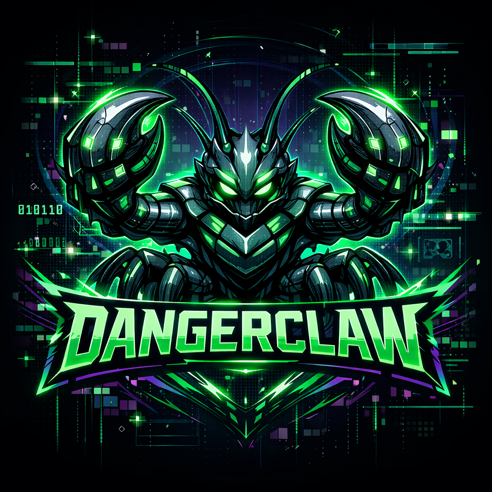

> *everything your AI should know before it helpfully makes things worse*

```
> install

Put `WARNINGS.md` somewhere your AI will read it — a project root, a global config directory,
or the start of your system prompt — and tell it to read the file before you begin.

> contribute

If you or someone you know has an AI cautionary tale worth adding, open a PR.
```

## Star History

[](https://www.star-history.com/?repos=hermanl0%2Fdangerclaw&type=date&legend=top-left)
